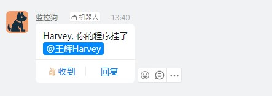

# ding

一款非常简单的钉钉群机器人发送通知的Go模块

<br/>

### 安装

钉钉群机器人设置为 "加签" 验证 ([如何开启钉钉群机器人](HOWTO.md))

```
go get -u github.com/wanghuiyt/ding
```

<br/>

### 例子

> 普通消息

```go
import "github.com/wanghuiyt/ding"

d := ding.Webhook{
    AccessToken: "8c03f234ddf2axxxxxxxxxxxx",
    Secret:      "SECefded9b38b761fxxxxxxxx",
}
err := d.SendMessage("这是普通的群消息")
...
```

Done!

<br/>


### 使用

> import "github.com/wanghuiyt/ding"

##### 普通消息

```go
d := ding.Webhook{
    AccessToken: "8c03f234ddf2axxxxxxxxxxxx",
    Secret:      "SECefded9b38b761fxxxxxxxx",
}
err := d.SendMessage("这是普通的群消息")
```

<br/>

##### @特定人的消息

```go
d := ding.Webhook{
    AccessToken: "8c03f234ddf2axxxxxxxxxxxx",
    Secret:      "SECefded9b38b761fxxxxxxxx",
    EnableAt:    true,
}
err := d.SendMessage("Harvey, 你的程序挂了", "1856362xxxx")
...
err = d.SendMessage("Harvey, Bob 和 Bella, 你们的程序挂了", "1856362xxxx", "1867800xxxx", "1715372xxxx")
```



<br/>

##### @所有人的消息

> 必须同时开启 `EnableAt` 和 `AtAll`

```go
d := ding.Webhook{
    AccessToken: "8c03f234ddf2axxxxxxxxxxxx",
    Secret:      "SECefded9b38b761fxxxxxxxx",
    EnableAt:    true, // 开启艾特
    AtAll:       true, // 艾特所有人
}
err := d.SendMessage("这是@所有人的消息")
```

