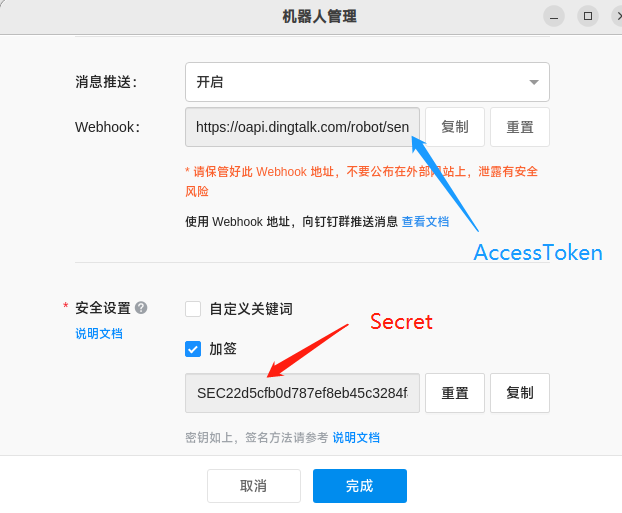
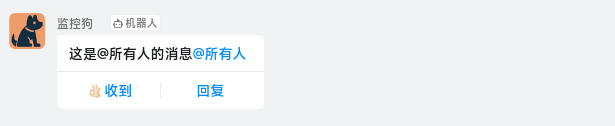

# ding

一款非常简单的钉钉群机器人发送通知的Go模块


### 安装

```
go get -u github.com/wanghuiyt/ding
```


### 获取机器人参数

> 钉钉群机器人必须设置为 "加签" 验证 ([如何开启钉钉群机器人](HOWTO.md))

获取 AccessToken 和 Secret 参数, AccessToken 为加签机器人的 Webhook 地址, 比如获取到的 Webhook 地址为 `https://oapi.dingtalk.com/robot/send?access_token=8c03f234ddf2axxxxxxxxxxxx`, 那么 AccessToken 应该填写 `8c03f234ddf2axxxxxxxxxxxx`




### 例子

> 普通群消息

```go
import "github.com/wanghuiyt/ding"

d := ding.Webhook{
    AccessToken: "8c03f234ddf2axxxxxxxxxxxx",
    Secret:      "SECefded9b38b761fxxxxxxxx",
}
err := d.SendMessageText("这是普通的群消息")
...
```

Done !


### 使用

> import "github.com/wanghuiyt/ding"
<br>
##### 普通消息
```go
d := ding.Webhook{
    AccessToken: "8c03f234ddf2axxxxxxxxxxxx",
    Secret:      "SECefded9b38b761fxxxxxxxx",
}
err := d.SendMessageText("这是普通消息")
```


<br>

##### @特定人的消息

@对象必须为绑定钉钉的手机号

```go
...
err := d.SendMessageText("Lucy, Harvey, 你们的程序挂了", "18578924567", "+13414567890")
```


<br>

##### @所有人的消息

```go
...
err := d.SendMessage("这是@所有人的消息", "*")
...
```

